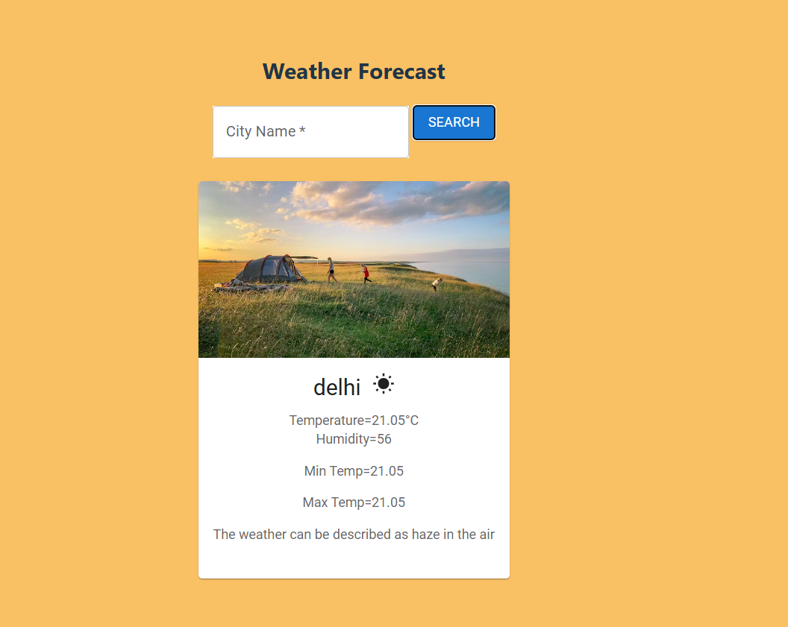
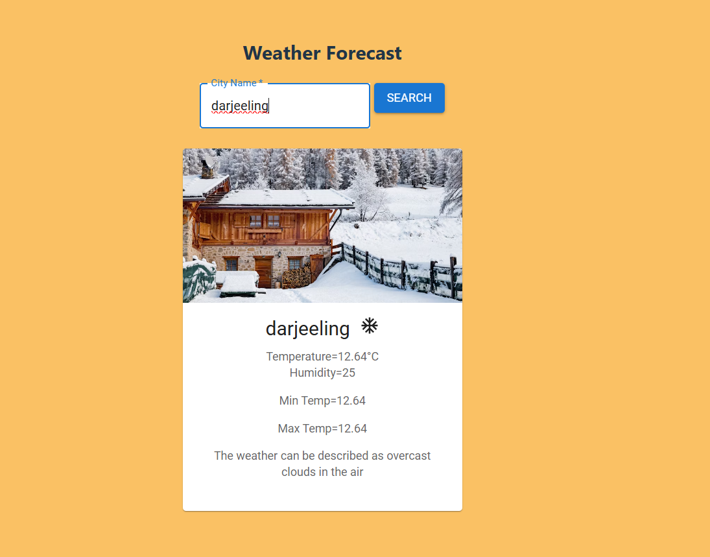

# Weather Forecasting App 

A modern and intuitive weather forecasting application that provides real-time weather updates based on user input. The app utilizes a weather API to fetch and display accurate weather data, offering a seamless user experience with a visually appealing interface.

## Features  

**Real-Time Weather Updates** – Fetches accurate weather details instantly
**Interactive & User-Friendly UI** –  Designed for a smooth and responsive experience 
**Comprehensive Weather Data** – Displays temperature, humidity, min/max temperature, and weather conditions 
**Seamless API Integration** – Utilizes the OpenWeatherMap API for real-time data retrieval
## Technologies Used  

**Frontend**: React.js (JavaScript ES6+)  
**Styling**: CSS for an elegant and user-friendly interface  
**Weather API**: Fetching real-time weather information  

## Installation & Setup  

**Clone the repository** - `git clone https://github.com/yourusername/lucky-number-game.git`  
**Navigate** - `cd weather-forecasting`  
**Install dependencies** - `npm install`  
**Start the development server** - `npm run dev`  
**Open in the browser** - The application will be accessible at `http://localhost:5173`  

## Preview  

  
  
